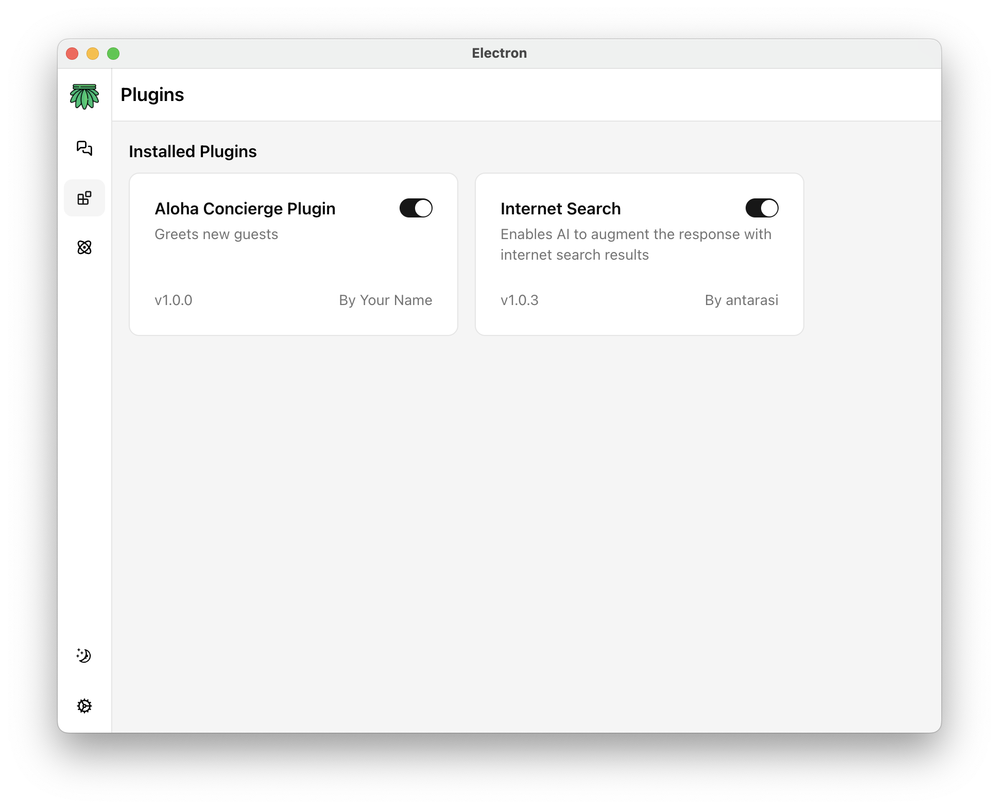
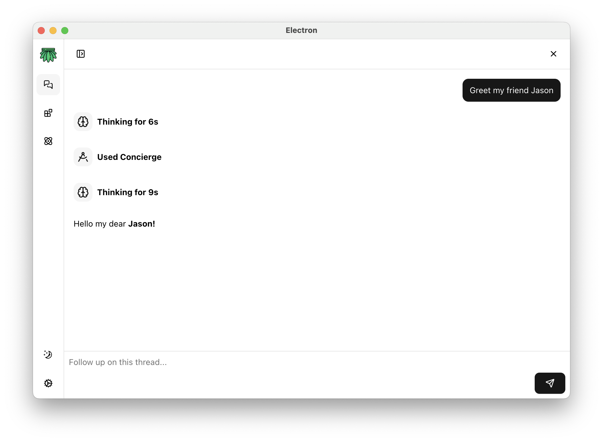

# aloha-sdk
Aloha Desktop SDK for plugin development

[](https://npmjs.com/package/aloha-sdk)
[](https://github.com/antarasi/aloha-sdk/actions/workflows/npm-publish.yml)

## Complete Plugin Example (simplified - no bundler)

### Plugin Project Structure

```
your-plugin/
├── src/
│   └── index.esm.js              # Main plugin entry point
├── public/
│   └── icon.svg                  # Plugin icon
├── tests/
│   └── validate-export.test.mjs  # Tests
└── manifest.json                 # Plugin manifest file
```

### 1. Write Plugin Code 

```js
export default class SayHelloPlugin {
  constructor(context) {
    super(context) // the plugin context allows the plugin to interact with the agent
  }

  async toolCall(toolName, args) {
    if (toolName !== 'sayHello') {
      throw new Error(`This tool is not available in **Concierge Plugin**`)
    }

    return `Hello my dear **${args.personName}!**`
  }
}
```

### 2. Define Plugin Manifest

The `manifest.json` file describe the plugin capabilities to Aloha Desktop agent:

```json
{
  "manifestVersion": 1,
  "name": "Aloha Concierge Plugin",
  "version": "1.0.0",
  "description": "Greets new guests",
  "author": "Your Name",
  "icon": "public/icon.svg",
  "main": "src/index.esm.js",
  "tools": [
    {
      "name": "sayHello",
      "displayName": "Concierge",
      "description": "The agent can use this tool to greet the user",
      "parameters": {
        "type": "object",
        "required": ["personName"],
        "properties": {
          "personName": {
            "type": "string",
            "description": "Person to which say hello"
          }
        }
      }
    }
  ]
}
```

### 3. Install the Plugin



### 4. Aloha Agent can now use the tool when needed



## Plugin release

To make your plugin availble as community plugin to download in the Aloha Desktop App, publish a release of your plugin on GitHub and update `plugins.json` on [aloha-releases repository](https://github.com/antarasi/aloha-releases).

The release needs to have 2 assets with exact file names as below:
1. `manifest.json` - the plugin manifest - see example above
2. `plugin.tgz` - tarball archive with all the files your plugin requires at runtime

#### Example plugin.tgz content:
```
plugin.tgz
├── src/
│   └── index.esm.js              
└── public/
    └── icon.svg
```

## Plugins with dependencies

To bundle dependencies with your plugin we recommend using a bundler. 

To get started quickly use the official [vite-aloha template](https://github.com/antarasi/vite-aloha)

## Plugin Requirements

1. Max icon size 10kB
2. Supported icon formats:
```
  image/svg+xml
  image/png
  image/jpeg
  image/jpg
  image/gif
  image/webp
  image/ico
  image/x-icon
  image/bmp
  image/tiff
```
3. Use only monochrome icon (#171717) with transparent background, preferably svg from [Lucide](https://lucide.dev/icons/), colors will be inverted automatically for dark mode
4. See [Publishing Requirements](https://github.com/antarasi/aloha-releases?tab=readme-ov-file#publishing-requirements)

## CLI Usage

The aloha-sdk package includes a CLI tool for automatic version management. After installing aloha-sdk as a dev dependency, you can use the CLI to copy the version from your package.json to a manifest file.

You can use it on a plugin `prebuild` script to update the plugin version on every build:

```json
{
  "scripts": {
    "prebuild": "aloha version package.json manifest.json"
  }
}
```

